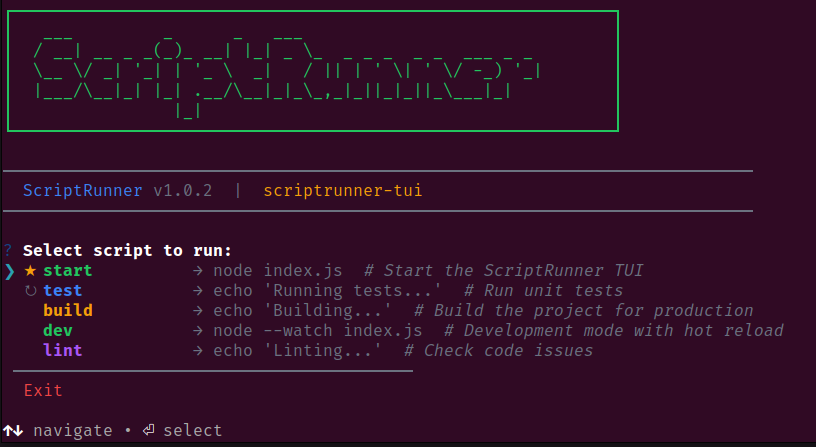
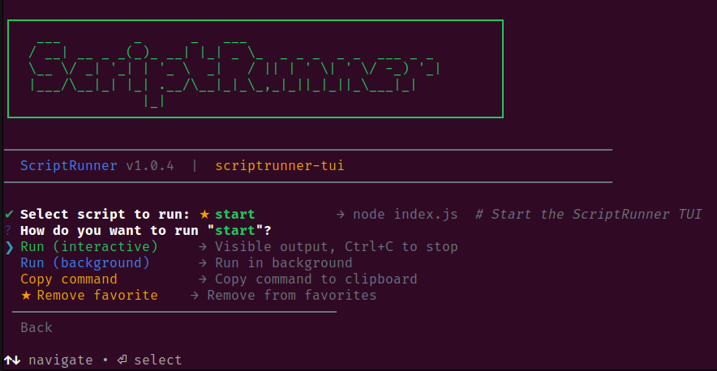
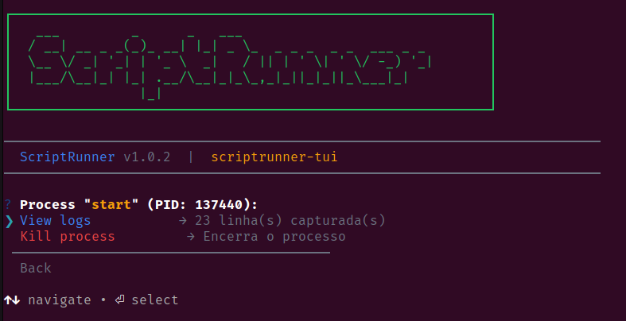

# ScriptRunner

[](https://www.npmjs.com/package/scriptrunner-tui)
[](https://github.com/mateusflorez/scriptrunner-tui)
[](https://opensource.org/licenses/MIT)

A terminal UI for running package.json scripts interactively.

```
  ╔═══════════════════════════════════════════════════════════════════════╗
  ║   _____           _       __  ____                                    ║
  ║  / ___/__________(_)___  / /_/ __ \__  ______  ____  ___  _____       ║
  ║  \__ \/ ___/ ___/ / __ \/ __/ /_/ / / / / __ \/ __ \/ _ \/ ___/       ║
  ║ ___/ / /__/ /  / / /_/ / /_/ _, _/ /_/ / / / / / / /  __/ /           ║
  ║/____/\___/_/  /_/ .___/\__/_/ |_|\__,_/_/ /_/_/ /_/\___/_/            ║
  ║                /_/                                                    ║
  ╚═══════════════════════════════════════════════════════════════════════╝
```

## Features

- **Interactive script selection** - Browse and select scripts with arrow keys
- **Run in foreground or background** - Choose execution mode per script
- **Background process management** - View logs, monitor and kill processes
- **Copy command to clipboard** - Quick access to the underlying npm command
- **Script descriptions** - Shows `scriptsDescriptions` from package.json
- **Execution history** - Recent scripts appear at the top of the menu
- **Monorepo support** - Auto-detects npm/yarn/pnpm workspaces and Lerna
- **Favorites** - Star frequently used scripts for quick access

## Installation

```bash
npm install -g scriptrunner-tui
```

## Usage

```bash
scriptrunner
# or
sr
```

### Options

```
  -d, --directory <path>  Specify project directory
  -l, --list              List scripts without running
  -h, --help              Show help message
  -v, --version           Show version
```

### Examples

```bash
sr                    # Interactive mode in current directory
sr dev                # Run 'dev' script directly
sr -d ./myapp         # Use different directory
sr -l                 # List available scripts
```

## Requirements

- Node.js 18+

## Screenshots





## License

MIT
